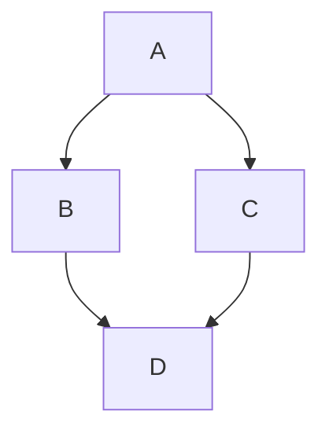
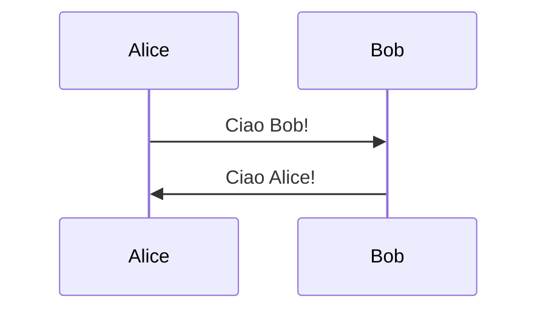
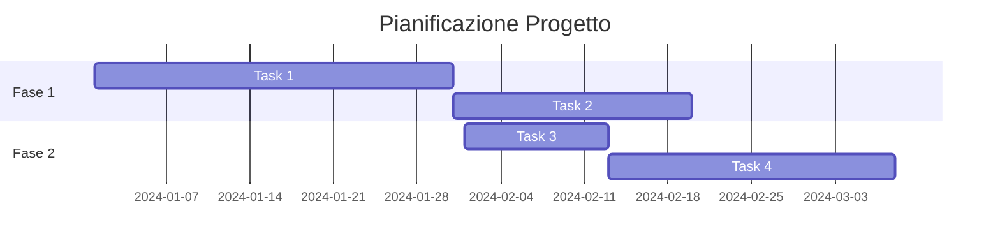
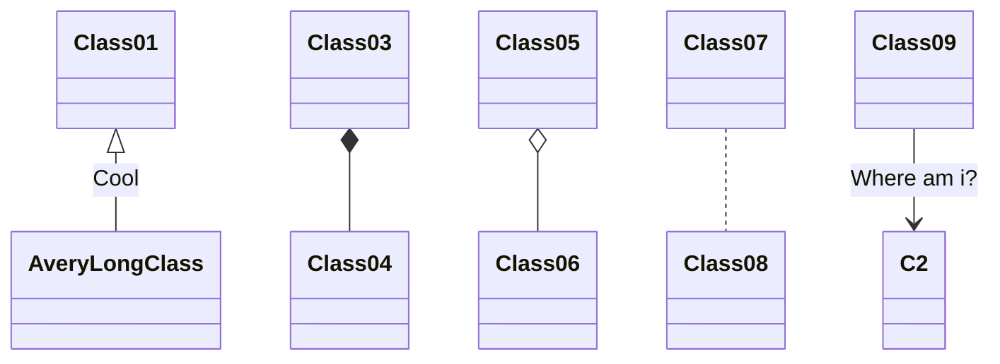
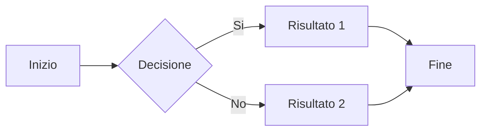

# Titolo 1
## Titolo 2
### Titolo 3
#### Titolo 4
##### Titolo 5
###### Titolo 6


## Grassetto e Corsivo
- **grassetto**
- *corsivo*
- ***grassetto e corsivo***

## Elenchi
- elemento 1
- elemento 2
  - sottoelemento 2.1
  - sottoelemento 2.2
- elemento 3

## Link
- [Testo del link](http://www.example.com)

## Immagini
- 

## Tabelle
| Intestazione 1 | Intestazione 2 |
|----------------|----------------|
| Cella 1        | Cella 2        |
| Cella 3        | Cella 4        |

## Citazioni
> Questa è una citazione di esempio.

## Codice Inline
- `codice inline`

## Blocchi di Codice
```python
def esempio():
    print("Questo è un blocco di codice in Python")
```

## Link Ancorato
- [Vai alla sezione 2](#2-architettura-stazione)

## Tabelle di Codice
```plaintext
| Comando        | Descrizione                     |
|----------------|---------------------------------|
| MOVE_LINEAR    | Muove il robot in linea retta   |
| SET_SPEED      | Imposta la velocità del robot   |
```
## Liste Numerate
1. Primo elemento
2. Secondo elemento
   1. Sottoelemento 2.1
   2. Sottoelemento 2.2
3. Terzo elemento

## Blocchi di Citazione con Codice
> Esempio di blocco di citazione con codice:
> ```javascript
> console.log("Ciao, mondo!");
> ```

## Tabelle con Allineamento
| Sinistra       | Centro        | Destra        |
|:--------------|:-------------:|--------------:|
| Testo sinistra | Testo centro  | Testo destra  |

## Liste di Controllo
- [x] Elemento completato
- [ ] Elemento da completare

## Tabelle Annidate
| Intestazione 1 | Intestazione 2 |
|----------------|----------------|
| Cella 1        | Cella 2        |
| Cella 3        |
  | Sotto-cella 3.1 | Sotto-cella 3.2 |

## Caratteri Speciali
- &amp; (e commerciale)
- &lt; (minore di)
- &gt; (maggiore di)

## Linee Orizzontali
---
___
***

## Evidenziazione
- barrato: ~~testo~~
- evidenziatore standard: <mark>testo</mark>
- evidenziatore altri colori: <mark style="background-color: #FFB6C1;">testo</mark>

## Annotazioni
- nota su sorgente <!--testo-->

## Math
- $x^2$
- $e^{x+1}$
- $H_2O$
- $\frac{a}{b}$
- $\sqrt{x}$
- $\sqrt[3]{x}$
- $\sum_{i=1}^{n}$
- $\int_{a}^{b} f(x) dx$
- $\lim_{x \to \infty}$
- $\alpha, \beta, \gamma, \delta, \epsilon, \theta, \lambda, \mu, \pi, \sigma, \phi, \omega$
- $\Delta, \nabla, \partial, \infty, \approx, \equiv, \neq, \leq, \geq$
- $\vec{v}, \hat{u}, \bar{x}$
- $\sin(x), \cos(x), \tan(x), \log(x), \ln(x)$
- $\forall, \exists, \in, \notin, \subset, \cup, \cap$
- $\mathbb{R}, \mathbb{Z}, \mathbb{N}, \mathbb{Q}, \mathbb{C}$
- $\langle a, b \rangle, |x|, \|v\|$
- $\angle ABC, \measuredangle ABC$
- $\top, \bot, \vdash, \models$

## Blocchi di Equazioni Math
Equazioni su più righe:
$$
\begin{aligned}
f(x) &= x^2 + 2x + 1 \\
&= (x + 1)^2
\end{aligned}
$$

Matrici:
$$
\begin{bmatrix}
a & b \\
c & d
\end{bmatrix}
$$

Sistema di equazioni:
$$
\begin{cases}
x + y = 5 \\
x - y = 1
\end{cases}
$$

## HTML Inline
È possibile utilizzare HTML direttamente in Markdown:

<div style="background-color: #f0f0f0; padding: 10px; border-radius: 5px;">
Questo è un div HTML personalizzato
</div>

<details>
<summary>Clicca per espandere</summary>

Contenuto nascosto che appare al click
</details>

## Colori e Stili
- Testo <span style="color: red;">rosso</span>
- Testo <span style="color: blue;">blu</span>
- Testo <span style="color: green;">verde</span>
- Testo <span style="font-size: 20px;">grande</span>
- Testo <span style="font-family: monospace;">monospace</span>

## Note a Piè di Pagina
Ecco una frase con una nota a piè di pagina.[^1]

Ecco un'altra frase con una nota diversa.[^2]

[^1]: Questa è la prima nota a piè di pagina.
[^2]: Questa è la seconda nota a piè di pagina.

## Definizioni
Termine 1
: Definizione del termine 1

Termine 2
: Definizione del termine 2
: Definizione alternativa del termine 2

## Escape di Caratteri Speciali
Usa il backslash per visualizzare caratteri speciali letteralmente:
- \* asterisco senza formattazione
- \_ underscore senza formattazione
- \# hashtag senza titolo
- \[ parentesi quadra
- \] parentesi quadra chiusa
- \\ backslash
- \` backtick

## Link di Riferimento
Questo è un [link di esempio][1] che usa riferimenti.

Ecco un [altro link][esempio] con etichetta testuale.

[1]: http://www.example.com
[esempio]: http://www.example.org

## Immagini con Dimensioni


## Immagini come Link
[](http://www.example.com)

## Liste Numerate Personalizzate
1. Primo elemento
1. Secondo elemento (il numero viene auto-incrementato)
1. Terzo elemento

100. Elemento con numero personalizzato
101. Continua la numerazione

## Blockquote Annidati
> Livello 1 di citazione
>> Livello 2 di citazione
>>> Livello 3 di citazione

> Citazione con elementi multipli
>
> - elemento 1
> - elemento 2
>
> **Testo in grassetto nella citazione**

## Codice con Numeri di Riga (GitHub Flavored Markdown)
```python {.line-numbers}
def esempio():
    for i in range(10):
        print(i)
```

## Codice con Evidenziazione Linee
```javascript
function esempio() {
    console.log("Linea normale");
    console.log("Linea evidenziata"); // [!code highlight]
    console.log("Linea normale");
}
```

## Tabelle Complesse
| Colonna 1 | Colonna 2 | Colonna 3 | Colonna 4 |
|:----------|:---------:|:---------:|----------:|
| Sinistra  | Centro    | Centro    | Destra    |
| **Grassetto** | *Corsivo* | `codice` | ~~barrato~~ |
| [Link](url) |  | 1,234 | 100% |
| ✅ | ❌ | ⚠️ | 🎉 |

## Emoji
Emoji comuni:
- 😀 😃 😄 😁 😆 😅 😂 🤣
- ❤️ 💔 💕 💖 💗 💙 💚 💛
- 👍 👎 👌 ✌️ 🤞 🤝 👏 🙏
- ⭐ ✨ 🌟 💫 🔥 💯 ✅ ❌
- 📝 📋 📊 📈 📉 📌 📍 🔗
- 💡 🔔 🎯 🏆 🎉 🎊 🎁 🎈

Oppure usando i codici:
- :smile: :heart: :+1: :tada:
- :warning: :heavy_check_mark: :x:

## Link Automatici
URL automatici: <http://www.example.com>
Email automatiche: <email@example.com>

## Apici e Pedici (con HTML)
- Apice: H<sub>2</sub>O (pedice)
- Pedice: X<sup>2</sup> (apice)
- E = mc<sup>2</sup>
- H<sub>2</sub>SO<sub>4</sub>

## Tastiera e Input
Per indicare tasti da premere:
- <kbd>Ctrl</kbd> + <kbd>C</kbd>
- <kbd>Alt</kbd> + <kbd>F4</kbd>
- <kbd>Enter</kbd>
- <kbd>Esc</kbd>

## Abbreviazioni
Le abbreviazioni possono essere definite così:

HTML è un linguaggio di markup.
CSS viene usato per lo stile.

*[HTML]: HyperText Markup Language
*[CSS]: Cascading Style Sheets

## Alert e Box Informativi (GitHub)
> [!NOTE]
> Informazione utile che gli utenti dovrebbero conoscere.

> [!TIP]
> Suggerimento utile per fare le cose meglio o più facilmente.

> [!IMPORTANT]
> Informazione chiave necessaria per il successo dell'utente.

> [!WARNING]
> Informazione critica da tenere in considerazione per evitare problemi.

> [!CAUTION]
> Conseguenze negative di un'azione.

## Diagrammi Mermaid
Markdown supporta i diagrammi Mermaid su molte piattaforme:



Diagramma di sequenza:


Diagramma di Gantt:


Diagramma di classe:


Flowchart:


## Diagrammi con Codice ASCII
```
+----------------+
|   Box Title    |
+----------------+
| Content here   |
| More content   |
+----------------+

   ┌───────────┐
   │  Process  │
   └─────┬─────┘
         │
         ▼
   ┌───────────┐
   │  Output   │
   └───────────┘
```

## Grafici e Diagrammi con Plot
```gnuplot
set title "Grafico di esempio"
plot sin(x)
```

## Video Embed
Puoi incorporare video usando HTML:
<video width="320" height="240" controls>
  <source src="movie.mp4" type="video/mp4">
  Il tuo browser non supporta il tag video.
</video>

## iFrame
Incorpora contenuti esterni:
<iframe width="560" height="315" src="https://www.youtube.com/embed/dQw4w9WgXcQ" frameborder="0" allowfullscreen></iframe>

## Codice con Diff
```diff
- Riga rimossa
+ Riga aggiunta
  Riga invariata
! Riga modificata
# Commento
```

## Task List con Sotto-task
- [x] Task completato
  - [x] Sotto-task completato
  - [ ] Sotto-task da fare
- [ ] Task in attesa
  - [ ] Sotto-task 1
  - [ ] Sotto-task 2
- [ ] Task futuro

## Indice Automatico
[TOC]

Oppure:
<!-- TOC -->

## Metadati e Front Matter (per generatori di siti statici)
```yaml
---
title: Titolo del Documento
author: Nome Autore
date: 2026-01-21
tags: [markdown, tutorial, guida]
---
```

## Shortcodes Personalizzati (Hugo/Jekyll)
```

def ciao():
    print("Ciao mondo!")

```

## Commenti Multi-riga
<!--
Questo è un commento
su più righe
che non verrà visualizzato
-->

## Formattazione Avanzata del Testo
- Normale
- **Grassetto**
- *Corsivo*
- ***Grassetto e Corsivo***
- ~~Barrato~~
- <u>Sottolineato</u>
- <mark>Evidenziato</mark>
- `Codice inline`
- Testo<sup>apice</sup>
- Testo<sub>pedice</sub>
- <small>Testo piccolo</small>
- <big>Testo grande</big>

## Allineamento del Testo
<div align="center">
Testo centrato
</div>

<div align="right">
Testo allineato a destra
</div>

<div align="justify">
Testo giustificato su entrambi i lati, che si estende per occupare l'intera larghezza disponibile.
</div>

## Badge e Shields


## Citazioni con Autore
> "La vita è ciò che ti accade mentre sei impegnato a fare altri progetti."
>
> — John Lennon

## Caratteri Speciali e Simboli
- © (copyright): &copy;
- ® (registered): &reg;
- ™ (trademark): &trade;
- € (euro): &euro;
- £ (pound): &pound;
- ¥ (yen): &yen;
- ° (grado): &deg;
- ± (più o meno): &plusmn;
- × (moltiplicazione): &times;
- ÷ (divisione): &divide;
- ≠ (diverso): &ne;
- ≤ (minore o uguale): &le;
- ≥ (maggiore o uguale): &ge;
- → (freccia destra): &rarr;
- ← (freccia sinistra): &larr;
- ↑ (freccia su): &uarr;
- ↓ (freccia giù): &darr;
- • (punto elenco): &bull;
- § (paragrafo): &sect;

## Tabelle con Colspan e Rowspan (HTML)
<table>
  <tr>
    <th>Colonna 1</th>
    <th>Colonna 2</th>
    <th>Colonna 3</th>
  </tr>
  <tr>
    <td rowspan="2">Riga che copre 2 righe</td>
    <td>Cella normale</td>
    <td>Cella normale</td>
  </tr>
  <tr>
    <td colspan="2">Cella che copre 2 colonne</td>
  </tr>
</table>

## Codice Multi-linguaggio
### Python
```python
def fibonacci(n):
    if n <= 1:
        return n
    return fibonacci(n-1) + fibonacci(n-2)
```

### JavaScript
```javascript
const fibonacci = (n) => {
    if (n <= 1) return n;
    return fibonacci(n-1) + fibonacci(n-2);
};
```

### Java
```java
public int fibonacci(int n) {
    if (n <= 1) return n;
    return fibonacci(n-1) + fibonacci(n-2);
}
```

### C++
```cpp
int fibonacci(int n) {
    if (n <= 1) return n;
    return fibonacci(n-1) + fibonacci(n-2);
}
```

### SQL
```sql
SELECT * FROM users 
WHERE age > 18 
ORDER BY name ASC;
```

### Bash
```bash
#!/bin/bash
for i in {1..10}; do
    echo "Numero: $i"
done
```

### JSON
```json
{
  "name": "Mario Rossi",
  "age": 30,
  "city": "Roma",
  "skills": ["JavaScript", "Python", "SQL"]
}
```

### YAML
```yaml
server:
  host: localhost
  port: 8080
  enabled: true
  features:
    - authentication
    - logging
```

### XML
```xml
<?xml version="1.0" encoding="UTF-8"?>
<root>
  <person>
    <name>Mario Rossi</name>
    <age>30</age>
  </person>
</root>
```

## Best Practices
1. **Usare titoli gerarchici** - Non saltare livelli di intestazione
2. **Liste consistenti** - Usare sempre lo stesso simbolo (- o * o +)
3. **Righe vuote** - Lasciare righe vuote tra sezioni per leggibilità
4. **Link descrittivi** - Usare testo descrittivo per i link, non "clicca qui"
5. **Alt text per immagini** - Sempre fornire testo alternativo
6. **Codice formattato** - Specificare sempre il linguaggio nei code block
7. **Tabelle semplici** - Mantenere le tabelle il più semplici possibile
8. **Evitare HTML quando possibile** - Preferire Markdown nativo

## Risorse e Riferimenti
- [Guida Ufficiale Markdown](https://www.markdownguide.org/)
- [GitHub Flavored Markdown](https://github.github.com/gfm/)
- [CommonMark Spec](https://commonmark.org/)
- [Markdown Cheatsheet](https://github.com/adam-p/markdown-here/wiki/Markdown-Cheatsheet)
- [Dillinger - Online MD Editor](https://dillinger.io/)
- [StackEdit - Editor](https://stackedit.io/)